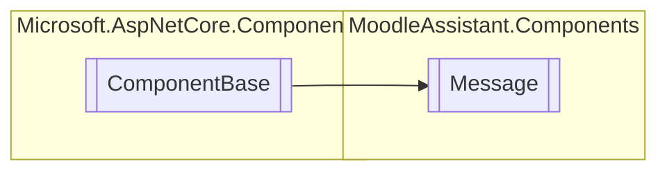

# Message `Public class`

## Description
Represents a message component.

## Diagram


## Members
### Properties
#### Public  properties
| Type | Name | Methods |
| --- | --- | --- |
| `bool` | [`CanClose`](#canclose)<br>Indicates whether the message can be closed. | `get, set` |
| `string` | [`MsgText`](#msgtext)<br>The message's text. | `get, set` |
| [`MessageType`](./MessageType.md) | [`Type`](#type)<br>The message's type. | `get, set` |

### Methods
#### Protected  methods
| Returns | Name |
| --- | --- |
| `void` | [`BuildRenderTree`](#buildrendertree)(`RenderTreeBuilder` __builder) |
| `void` | [`OnInitialized`](#oninitialized)()<br>The component OnInitialized lifecycle method. |

#### Public  methods
| Returns | Name |
| --- | --- |
| `void` | [`Refresh`](#refresh)()<br>Refreshes the component. |
| `void` | [`Show`](#show)()<br>Shows the message. |

## Details
### Summary
Represents a message component.

### Inheritance
 - `ComponentBase`

### Constructors
#### Message
[*Source code*](https://github.com///blob//MoodleAssistant/Components/Message.razor.cs#L13)
```csharp
public Message()
```

### Methods
#### OnInitialized
[*Source code*](https://github.com///blob//MoodleAssistant/Components/Message.razor.cs#L36)
```csharp
protected override void OnInitialized()
```
##### Summary
The component OnInitialized lifecycle method.

#### Show
[*Source code*](https://github.com///blob//MoodleAssistant/Components/Message.razor.cs#L43)
```csharp
public void Show()
```
##### Summary
Shows the message.

#### Refresh
[*Source code*](https://github.com///blob//MoodleAssistant/Components/Message.razor.cs#L57)
```csharp
public void Refresh()
```
##### Summary
Refreshes the component.

#### BuildRenderTree
[*Source code*](https://github.com///blob//MoodleAssistant/Components/Message.razor#L16707566)
```csharp
protected override void BuildRenderTree(RenderTreeBuilder __builder)
```
##### Arguments
| Type | Name | Description |
| --- | --- | --- |
| `RenderTreeBuilder` | __builder |   |

### Properties
#### MsgText
```csharp
public string MsgText { get; set; }
```
##### Summary
The message's text.

#### Type
```csharp
public MessageType Type { get; set; }
```
##### Summary
The message's type.

#### CanClose
```csharp
public bool CanClose { get; set; }
```
##### Summary
Indicates whether the message can be closed.

*Generated with* [*ModularDoc*](https://github.com/hailstorm75/ModularDoc)
