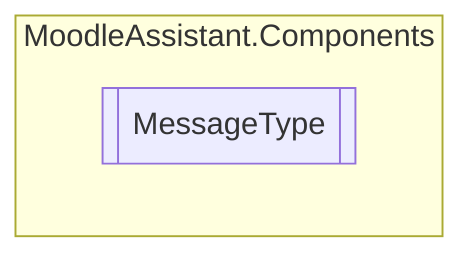

# MessageType `Public enum`

## Description
Represents the type of message to display.

## Diagram

## Details
### Summary
Represents the type of message to display.

### Fields
#### Error
##### Summary
Represents an error message.

#### Success
##### Summary
Represents a success message.

#### Warning
##### Summary
Represents a warning message.

#### Info
##### Summary
Represents an information message.

*Generated with* [*ModularDoc*](https://github.com/hailstorm75/ModularDoc)
