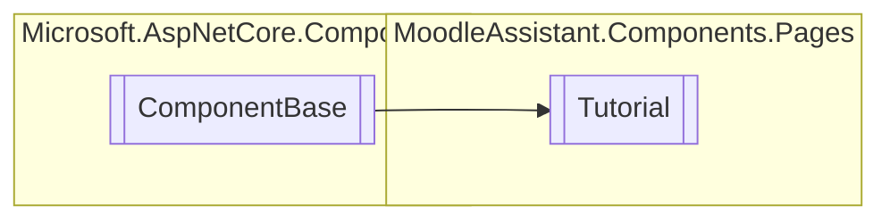

# Tutorial `Public class`

## Diagram


## Members
### Methods
#### Protected  methods
| Returns | Name |
| --- | --- |
| `void` | [`BuildRenderTree`](#buildrendertree)(`RenderTreeBuilder` __builder) |

## Details
### Inheritance
 - `ComponentBase`

### Constructors
#### Tutorial
```csharp
public Tutorial()
```

### Methods
#### BuildRenderTree
```csharp
protected override void BuildRenderTree(RenderTreeBuilder __builder)
```
##### Arguments
| Type | Name | Description |
| --- | --- | --- |
| `RenderTreeBuilder` | __builder |   |

*Generated with* [*ModularDoc*](https://github.com/hailstorm75/ModularDoc)
