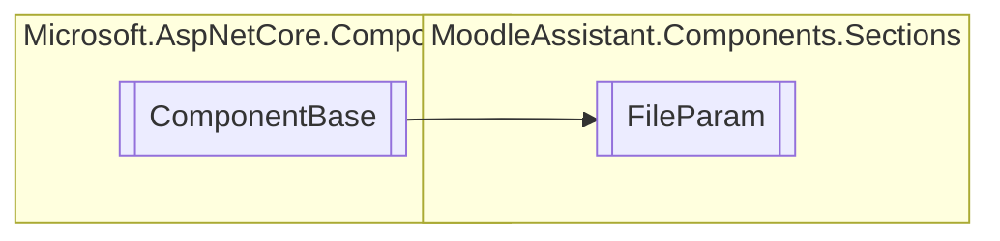

# FileParam `Public class`

## Description
Represents a section of the page that handles file uploads for file-type paarameters.

## Diagram


## Members
### Properties
#### Public  properties
| Type | Name | Methods |
| --- | --- | --- |
| [`Error`](../../logic/utils/Error.md) | [`ErrorMsg`](#errormsg)<br>The error of the section. | `get, private set` |
| `bool` | [`IsUploading`](#isuploading) | `get` |
| `EventCallback`&lt;`bool`&gt; | [`OnSuccess`](#onsuccess)<br>The event callback invoked when the submit process is successful. | `get, set` |
| `bool` | [`SuccessUpload`](#successupload) | `get` |

### Methods
#### Protected  methods
| Returns | Name |
| --- | --- |
| `void` | [`BuildRenderTree`](#buildrendertree)(`RenderTreeBuilder` __builder) |

## Details
### Summary
Represents a section of the page that handles file uploads for file-type paarameters.

### Inheritance
 - `ComponentBase`

### Constructors
#### FileParam
[*Source code*](https://github.com///blob//MoodleAssistant/Components/Sections/FileParam.razor.cs#L22)
```csharp
public FileParam()
```

### Methods
#### BuildRenderTree
[*Source code*](https://github.com///blob//MoodleAssistant/Components/Sections/FileParam.razor#L16707566)
```csharp
protected override void BuildRenderTree(RenderTreeBuilder __builder)
```
##### Arguments
| Type | Name | Description |
| --- | --- | --- |
| `RenderTreeBuilder` | __builder |   |

### Properties
#### OnSuccess
```csharp
public EventCallback<bool> OnSuccess { get; set; }
```
##### Summary
The event callback invoked when the submit process is successful.

#### ErrorMsg
```csharp
public Error ErrorMsg { get; private set; }
```
##### Summary
The error of the section.

#### IsUploading
```csharp
public bool IsUploading { get; }
```

#### SuccessUpload
```csharp
public bool SuccessUpload { get; }
```

*Generated with* [*ModularDoc*](https://github.com/hailstorm75/ModularDoc)
