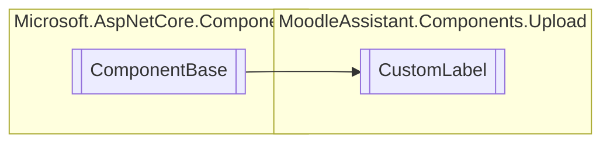

# CustomLabel `Public class`

## Description
The custom label component for a [DropInput](./DropInput.md) component.

## Diagram


## Members
### Properties
#### Public  properties
| Type | Name | Methods |
| --- | --- | --- |
| `IDictionary`&lt;`string`, `object`&gt; | [`AdditionalAttributes`](#additionalattributes)<br>The additional attributes of the component. | `get, set` |
| `RenderFragment` | [`ChildContent`](#childcontent)<br>The RenderFragment representing the child content. | `get, set` |
| `string` | [`InputName`](#inputname)<br>The name of the input element. | `get, set` |
| `bool` | [`IsVisible`](#isvisible)<br>The visibility of the component. | `get, set` |
| `int` | [`MaxFiles`](#maxfiles)<br>The maximum number of files that can be uploaded. | `get, init` |
| `EventCallback`&lt;`InputFileChangeEventArgs`&gt; | [`OnChange`](#onchange)<br>The event callback when the input element changes. | `get, set` |
| `Dictionary`&lt;`int`, `IBrowserFile`&gt; | [`UploadedFiles`](#uploadedfiles)<br>The uploaded files. | `get, set` |

### Methods
#### Protected  methods
| Returns | Name |
| --- | --- |
| `void` | [`BuildRenderTree`](#buildrendertree)(`RenderTreeBuilder` __builder) |

## Details
### Summary
The custom label component for a [DropInput](./DropInput.md) component.

### Inheritance
 - `ComponentBase`

### Constructors
#### CustomLabel
[*Source code*](https://github.com///blob//MoodleAssistant/Components/Upload/CustomLabel.razor.cs#L27)
```csharp
public CustomLabel()
```

### Methods
#### BuildRenderTree
[*Source code*](https://github.com///blob//MoodleAssistant/Components/Upload/CustomLabel.razor#L16707566)
```csharp
protected override void BuildRenderTree(RenderTreeBuilder __builder)
```
##### Arguments
| Type | Name | Description |
| --- | --- | --- |
| `RenderTreeBuilder` | __builder |   |

### Properties
#### ChildContent
```csharp
public RenderFragment ChildContent { get; set; }
```
##### Summary
The RenderFragment representing the child content.

#### AdditionalAttributes
```csharp
public IDictionary<string, object> AdditionalAttributes { get; set; }
```
##### Summary
The additional attributes of the component.

#### InputName
```csharp
public string InputName { get; set; }
```
##### Summary
The name of the input element.

#### MaxFiles
```csharp
public int MaxFiles { get; init; }
```
##### Summary
The maximum number of files that can be uploaded.

#### UploadedFiles
```csharp
public Dictionary<int, IBrowserFile> UploadedFiles { get; set; }
```
##### Summary
The uploaded files.

#### IsVisible
```csharp
public bool IsVisible { get; set; }
```
##### Summary
The visibility of the component.

#### OnChange
```csharp
public EventCallback<InputFileChangeEventArgs> OnChange { get; set; }
```
##### Summary
The event callback when the input element changes.

*Generated with* [*ModularDoc*](https://github.com/hailstorm75/ModularDoc)
