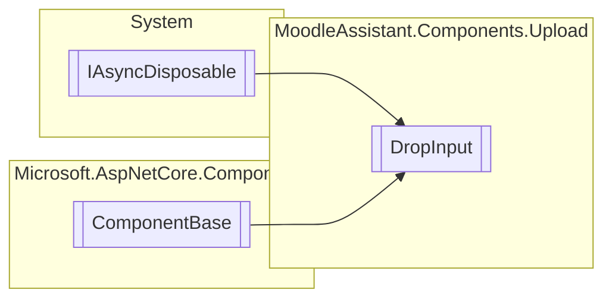

# DropInput `Public class`

## Description
The component for uploading one or multiple files.

## Diagram


## Members
### Properties
#### Public  properties
| Type | Name | Methods |
| --- | --- | --- |
| `RenderFragment` | [`ChildContent`](#childcontent)<br>The RenderFragment representing the child content. | `get, set` |
| `string` | [`InputName`](#inputname)<br>The name of the input element. | `get, set` |
| `int` | [`MaxFiles`](#maxfiles)<br>The maximum number of files that can be uploaded. | `get, init` |
| `Dictionary`&lt;`int`, `IBrowserFile`&gt; | [`UploadedFiles`](#uploadedfiles)<br>The uploaded files. | `get, private set` |

### Methods
#### Public  methods
| Returns | Name |
| --- | --- |
| `void` | [`ClearFiles`](#clearfiles)()<br>Clears the uploaded files. |
| `void` | [`RemoveFile`](#removefile)(`int` index)<br>Removes a file from the uploaded files. |

#### Protected  methods
| Returns | Name |
| --- | --- |
| `void` | [`BuildRenderTree`](#buildrendertree)(`RenderTreeBuilder` __builder) |
| `Task` | [`OnAfterRenderAsync`](#onafterrenderasync)(`bool` firstRender)<br>Function invoked when the component has been rendered. |

## Details
### Summary
The component for uploading one or multiple files.

### Inheritance
 - `IAsyncDisposable`
 - `ComponentBase`

### Constructors
#### DropInput
[*Source code*](https://github.com///blob//MoodleAssistant/Components/Upload/DropInput.razor.cs#L20)
```csharp
public DropInput()
```

### Methods
#### RemoveFile
[*Source code*](https://github.com///blob//MoodleAssistant/Components/Upload/DropInput.razor.cs#L72)
```csharp
public void RemoveFile(int index)
```
##### Arguments
| Type | Name | Description |
| --- | --- | --- |
| `int` | index | The index of the file to be removed. |

##### Summary
Removes a file from the uploaded files.

#### ClearFiles
[*Source code*](https://github.com///blob//MoodleAssistant/Components/Upload/DropInput.razor.cs#L80)
```csharp
public void ClearFiles()
```
##### Summary
Clears the uploaded files.

#### OnAfterRenderAsync
```csharp
protected override async Task OnAfterRenderAsync(bool firstRender)
```
##### Arguments
| Type | Name | Description |
| --- | --- | --- |
| `bool` | firstRender | `true` if this is the first time ComponentBase.OnAfterRender(System.Boolean) has been called; otherwise, `false` . |

##### Summary
Function invoked when the component has been rendered.

#### BuildRenderTree
[*Source code*](https://github.com///blob//MoodleAssistant/Components/Upload/DropInput.razor#L16707566)
```csharp
protected override void BuildRenderTree(RenderTreeBuilder __builder)
```
##### Arguments
| Type | Name | Description |
| --- | --- | --- |
| `RenderTreeBuilder` | __builder |   |

### Properties
#### ChildContent
```csharp
public RenderFragment ChildContent { get; set; }
```
##### Summary
The RenderFragment representing the child content.

#### InputName
```csharp
public string InputName { get; set; }
```
##### Summary
The name of the input element.

#### MaxFiles
```csharp
public int MaxFiles { get; init; }
```
##### Summary
The maximum number of files that can be uploaded.

#### UploadedFiles
```csharp
public Dictionary<int, IBrowserFile> UploadedFiles { get; private set; }
```
##### Summary
The uploaded files.

*Generated with* [*ModularDoc*](https://github.com/hailstorm75/ModularDoc)
