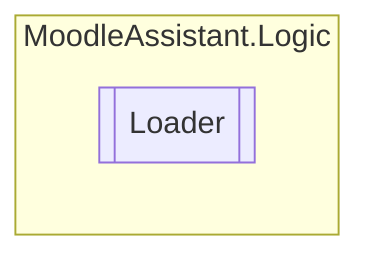

# Loader `Public class`

## Description
Loads the files uploaded by the user.

## Diagram


## Members
### Methods
#### Public  methods
| Returns | Name |
| --- | --- |
| `Task`&lt;`IEnumerable`&lt;`string``[]`&gt;&gt; | [`LoadCsv`](#loadcsv)(`IBrowserFile` file, [`XmlModel`](models/XmlModel.md) xmlModel)<br>Loads the CSV file and validates it. |
| `Task` | [`LoadFiles`](#loadfiles)(`IBrowserFile``[]` files)<br>Loads the files uploaded and validates them. |
| `Task`&lt;[`XmlModel`](models/XmlModel.md)&gt; | [`LoadXml`](#loadxml)(`IBrowserFile` file)<br>Loads the XML file and validates it. |

## Details
### Summary
Loads the files uploaded by the user.

### Constructors
#### Loader
[*Source code*](https://github.com///blob//MoodleAssistant/Logic/Loader.cs#L16707566)
```csharp
public Loader(IBrowserFileService fileService)
```
##### Arguments
| Type | Name | Description |
| --- | --- | --- |
| [`IBrowserFileService`](../services/IBrowserFileService.md) | fileService | An instance of [IBrowserFileService](../services/IBrowserFileService.md) to manage saved files. |

##### Summary
Loads the files uploaded by the user.

### Methods
#### LoadXml
```csharp
public async Task<XmlModel> LoadXml(IBrowserFile file)
```
##### Arguments
| Type | Name | Description |
| --- | --- | --- |
| `IBrowserFile` | file | An instance of IBrowserFile representing the XML file. |

##### Summary
Loads the XML file and validates it.

##### Returns
An instance of [XmlModel](models/XmlModel.md) to manage the file.

##### Exceptions
| Name | Description |
| --- | --- |
| [ReplicatorException](utils/ReplicatorException.md) | Thrown when a validation error occurs. |

#### LoadCsv
```csharp
public async Task<IEnumerable<string>> LoadCsv(IBrowserFile file, XmlModel xmlModel)
```
##### Arguments
| Type | Name | Description |
| --- | --- | --- |
| `IBrowserFile` | file | An instance of IBrowserFile representing the CSV file. |
| [`XmlModel`](models/XmlModel.md) | xmlModel | An instance of [XmlModel](models/XmlModel.md) representing the template XML file. |

##### Summary
Loads the CSV file and validates it.

##### Returns
A list of string arrays representing the CSV file.

##### Exceptions
| Name | Description |
| --- | --- |
| [ReplicatorException](utils/ReplicatorException.md) | Thrown when a validation error occurs. |

#### LoadFiles
```csharp
public async Task LoadFiles(IBrowserFile[] files)
```
##### Arguments
| Type | Name | Description |
| --- | --- | --- |
| `IBrowserFile``[]` | files | Sequence of IBrowserFile instances representing the uploaded files. |

##### Summary
Loads the files uploaded and validates them.

##### Exceptions
| Name | Description |
| --- | --- |
| [ReplicatorException](utils/ReplicatorException.md) | Thrown when a validation error occurs. |

*Generated with* [*ModularDoc*](https://github.com/hailstorm75/ModularDoc)
