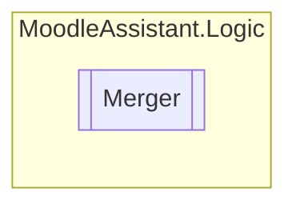

# Merger `Public class`

## Description
Represents a class that merges the template XML file with the CSV file to create a new XML file.

## Diagram


## Members
### Methods
#### Public  methods
| Returns | Name |
| --- | --- |
| `XmlDocument` | [`MergeQuestion`](#mergequestion)(`bool` previewMode)<br>This function creates a XML file with the replicated questions using the XML file as the template and the CSV file<br>            to find the parameter values. |

## Details
### Summary
Represents a class that merges the template XML file with the CSV file to create a new XML file.

### Constructors
#### Merger
[*Source code*](https://github.com///blob//MoodleAssistant/Logic/Merger.cs#L16707566)
```csharp
public Merger(IBrowserFileService fileService, XmlDocument template, IEnumerable<string[]> csvAsList)
```
##### Arguments
| Type | Name | Description |
| --- | --- | --- |
| [`IBrowserFileService`](../services/IBrowserFileService.md) | fileService |   |
| `XmlDocument` | template |   |
| `IEnumerable`&lt;`string``[]`&gt; | csvAsList |   |

### Methods
#### MergeQuestion
[*Source code*](https://github.com///blob//MoodleAssistant/Logic/Merger.cs#L30)
```csharp
public XmlDocument MergeQuestion(bool previewMode)
```
##### Arguments
| Type | Name | Description |
| --- | --- | --- |
| `bool` | previewMode | Whether the merge process is executing in preview mode or not. |

##### Summary
This function creates a XML file with the replicated questions using the XML file as the template and the CSV file
            to find the parameter values.

##### Returns
The merged XmlDocument .

*Generated with* [*ModularDoc*](https://github.com/hailstorm75/ModularDoc)
