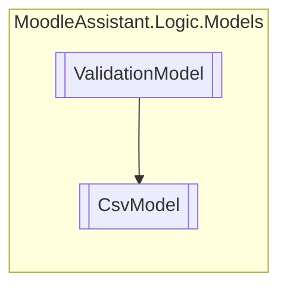

# CsvModel `Public class`

## Description
Manages the validation of a CSV file and other operations.

## Diagram


## Members
### Properties
#### Public Static properties
| Type | Name | Methods |
| --- | --- | --- |
| `string` | [`FileName`](#filename)<br>The standard name of the XML file managed by the [CsvModel](moodleassistant/logic/models/CsvModel.md) . | `get` |

#### Public  properties
| Type | Name | Methods |
| --- | --- | --- |
| `IEnumerable`&lt;`string`&gt; | [`AnswersParametersList`](#answersparameterslist)<br>Gets the parameters found in the answers. | `get, init` |
| `IEnumerable`&lt;`string`&gt; | [`QuestionParametersList`](#questionparameterslist)<br>Gets the parameters found in the question text | `get, init` |

### Methods
#### Public Static methods
| Returns | Name |
| --- | --- |
| `bool` | [`IsCsv`](#iscsv)(`IBrowserFile` file)<br>Checks if the IBrowserFile.ContentType of a file is CSV. |

#### Public  methods
| Returns | Name |
| --- | --- |
| `IEnumerable`&lt;`string``[]`&gt; | [`ConvertCsvToListOfArrayString`](#convertcsvtolistofarraystring)()<br>Converts the CSV file to a list of string arrays. |
| `bool` | [`HasValidHeader`](#hasvalidheader)()<br>Checks if the file with the [CsvModel](moodleassistant/logic/models/CsvModel.md) 's file name has a valid header. |
| `bool` | [`IsWellFormed`](#iswellformed)()<br>Checks if the file with the [CsvModel](moodleassistant/logic/models/CsvModel.md) 's file name is well-formed. |

## Details
### Summary
Manages the validation of a CSV file and other operations.

### Inheritance
 - [
`ValidationModel`
](./ValidationModel.md)

### Constructors
#### CsvModel
[*Source code*](https://github.com///blob//MoodleAssistant/Logic/Models/CsvModel.cs#L16707566)
```csharp
public CsvModel(IBrowserFile file, IBrowserFileService fileService)
```
##### Arguments
| Type | Name | Description |
| --- | --- | --- |
| `IBrowserFile` | file | The instance of IBrowserFile representing the file to validate. |
| [`IBrowserFileService`](../../services/IBrowserFileService.md) | fileService | An instance of [IBrowserFileService](../../services/IBrowserFileService.md) to manage saved files. |

##### Summary
Manages the validation of a CSV file and other operations.

### Methods
#### IsCsv
[*Source code*](https://github.com///blob//MoodleAssistant/Logic/Models/CsvModel.cs#L41)
```csharp
public static bool IsCsv(IBrowserFile file)
```
##### Arguments
| Type | Name | Description |
| --- | --- | --- |
| `IBrowserFile` | file | An instance of IBrowserFile representing the file. |

##### Summary
Checks if the IBrowserFile.ContentType of a file is CSV.

##### Returns
`true` if the file is CSV; otherwise `false` .

#### HasValidHeader
[*Source code*](https://github.com///blob//MoodleAssistant/Logic/Models/CsvModel.cs#L50)
```csharp
public bool HasValidHeader()
```
##### Summary
Checks if the file with the [CsvModel](moodleassistant/logic/models/CsvModel.md) 's file name has a valid header.

##### Returns
`true` if the file as a valid header; otherwise `false` .

#### IsWellFormed
[*Source code*](https://github.com///blob//MoodleAssistant/Logic/Models/CsvModel.cs#L66)
```csharp
public bool IsWellFormed()
```
##### Summary
Checks if the file with the [CsvModel](moodleassistant/logic/models/CsvModel.md) 's file name is well-formed.

##### Returns
`true` if the file is well-formed; otherwise `false` .

#### ConvertCsvToListOfArrayString
[*Source code*](https://github.com///blob//MoodleAssistant/Logic/Models/CsvModel.cs#L90)
```csharp
public IEnumerable<string> ConvertCsvToListOfArrayString()
```
##### Summary
Converts the CSV file to a list of string arrays.

##### Returns
A list of string arrays representing the parameters' values.

### Properties
#### FileName
```csharp
public static string FileName { get; }
```
##### Summary
The standard name of the XML file managed by the [CsvModel](moodleassistant/logic/models/CsvModel.md) .

#### QuestionParametersList
```csharp
public IEnumerable<string> QuestionParametersList { get; init; }
```
##### Summary
Gets the parameters found in the question text

#### AnswersParametersList
```csharp
public IEnumerable<string> AnswersParametersList { get; init; }
```
##### Summary
Gets the parameters found in the answers.

*Generated with* [*ModularDoc*](https://github.com/hailstorm75/ModularDoc)
