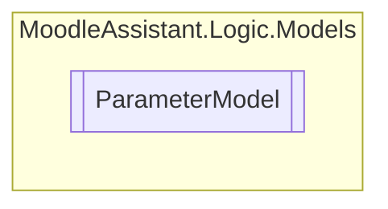

# ParameterModel `Public class`

## Description
Represents the parameters of the XML document.

## Diagram


## Members
### Properties
#### Public  properties
| Type | Name | Methods |
| --- | --- | --- |
| `int` | [`NeededFiles`](#neededfiles)<br>Gets the number of needed files. | `get` |

### Methods
#### Public  methods
| Returns | Name |
| --- | --- |
| `List`&lt;[`Parameter`](../parse/Parameter.md)&gt; | [`GetFileParameters`](#getfileparameters)()<br>Gets the file-type parameters in the XML document. |

## Details
### Summary
Represents the parameters of the XML document.

### Constructors
#### ParameterModel
[*Source code*](https://github.com///blob//MoodleAssistant/Logic/Models/ParameterModel.cs#L15)
```csharp
public ParameterModel(XmlDocument doc, int csvRows)
```
##### Arguments
| Type | Name | Description |
| --- | --- | --- |
| `XmlDocument` | doc | A XmlDocument instance. |
| `int` | csvRows | The number of csv rows in the CSV file. |

##### Summary
Represents the parameters of the XML document.

### Methods
#### GetFileParameters
[*Source code*](https://github.com///blob//MoodleAssistant/Logic/Models/ParameterModel.cs#L25)
```csharp
public List<Parameter> GetFileParameters()
```
##### Summary
Gets the file-type parameters in the XML document.

##### Returns
A list of the file-type parameters.

### Properties
#### NeededFiles
```csharp
public int NeededFiles { get; }
```
##### Summary
Gets the number of needed files.

*Generated with* [*ModularDoc*](https://github.com/hailstorm75/ModularDoc)
