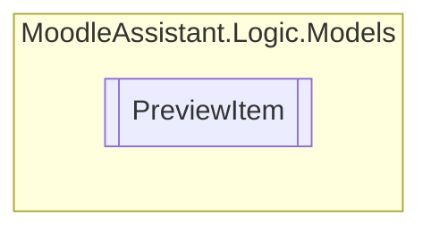

# PreviewItem `Public class`

## Description
Represents a preview item of a question tag (inside the merged XML file), with its question text and answers.

## Diagram


## Members
### Properties
#### Public  properties
| Type | Name | Methods |
| --- | --- | --- |
| `string``[]` | [`Answers`](#answers)<br>Gets or sets the answers. | `get, set` |
| `string` | [`QuestionText`](#questiontext)<br>Gets the question text. | `get` |

## Details
### Summary
Represents a preview item of a question tag (inside the merged XML file), with its question text and answers.

### Constructors
#### PreviewItem
[*Source code*](https://github.com///blob//MoodleAssistant/Logic/Models/PreviewItem.cs#L11)
```csharp
public PreviewItem(string questionText)
```
##### Arguments
| Type | Name | Description |
| --- | --- | --- |
| `string` | questionText | The question text String . |

##### Summary
Represents a preview item of a question tag (inside the merged XML file), with its question text and answers.

### Properties
#### QuestionText
```csharp
public string QuestionText { get; }
```
##### Summary
Gets the question text.

#### Answers
```csharp
public string Answers { get; set; }
```
##### Summary
Gets or sets the answers.

*Generated with* [*ModularDoc*](https://github.com/hailstorm75/ModularDoc)
