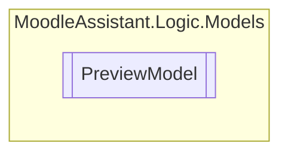

# PreviewModel `Public class`

## Description
Creates all the preview data for the current merged XML file.

## Diagram


## Members
### Properties
#### Public  properties
| Type | Name | Methods |
| --- | --- | --- |
| `List`&lt;[`PreviewItem`](./PreviewItem.md)&gt; | [`Items`](#items)<br>Gets the list of preview items. | `get` |

## Details
### Summary
Creates all the preview data for the current merged XML file.

### Constructors
#### PreviewModel
[*Source code*](https://github.com///blob//MoodleAssistant/Logic/Models/PreviewModel.cs#L12)
```csharp
public PreviewModel(XmlDocument question, int answers)
```
##### Arguments
| Type | Name | Description |
| --- | --- | --- |
| `XmlDocument` | question | The current XmlDocument . |
| `int` | answers | The current XmlDocument 's answer count. |

##### Summary
Initializes a new instance of the [PreviewModel](moodleassistant/logic/models/PreviewModel.md) class.

### Properties
#### Items
```csharp
public List<PreviewItem> Items { get; }
```
##### Summary
Gets the list of preview items.

*Generated with* [*ModularDoc*](https://github.com/hailstorm75/ModularDoc)
