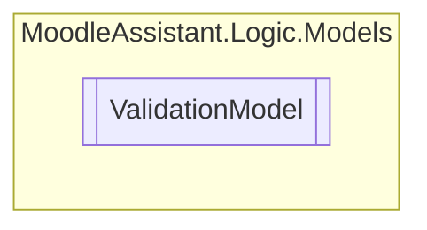

# ValidationModel `Public class`

## Description


## Diagram


## Members
### Methods
#### Public  methods
| Returns | Name |
| --- | --- |
| `bool` | [`IsEmpty`](#isempty)()<br>Checks if the file is empty. |

## Details
### Summary


### Constructors
#### ValidationModel
[*Source code*](https://github.com///blob//MoodleAssistant/Logic/Models/ValidationModel.cs#L16707566)
```csharp
public ValidationModel(IBrowserFile file)
```
##### Arguments
| Type | Name | Description |
| --- | --- | --- |
| `IBrowserFile` | file | The instance of IBrowserFile representing the file to validate. |

##### Summary


### Methods
#### IsEmpty
[*Source code*](https://github.com///blob//MoodleAssistant/Logic/Models/ValidationModel.cs#L14)
```csharp
public bool IsEmpty()
```
##### Summary
Checks if the file is empty.

##### Returns
`true` if the file is empty; otherwise `false`

*Generated with* [*ModularDoc*](https://github.com/hailstorm75/ModularDoc)
