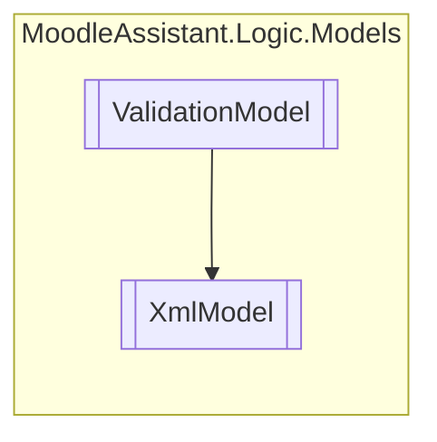

# XmlModel `Public class`

## Description
Manages the validation of a XML template file and its parameters.

## Diagram


## Members
### Properties
#### Public Static properties
| Type | Name | Methods |
| --- | --- | --- |
| `string` | [`FileName`](#filename)<br>The standard name of the XML file managed by the [XmlModel](moodleassistant/logic/models/XmlModel.md) . | `get` |

#### Public  properties
| Type | Name | Methods |
| --- | --- | --- |
| `int` | [`AnswerCount`](#answercount)<br>Gets the number of answers in the XML file. | `get, private set` |
| `IEnumerable`&lt;`string`&gt; | [`AnswerParametersList`](#answerparameterslist)<br>Gets the parameters found in the answers. | `get, private set` |
| `IEnumerable`&lt;`string`&gt; | [`QuestionParametersList`](#questionparameterslist)<br>Gets the parameters found in the question text. | `get, private set` |
| `XmlDocument` | [`XmlFile`](#xmlfile)<br>Gets the XML template document. | `get, private set` |

### Methods
#### Public Static methods
| Returns | Name |
| --- | --- |
| `bool` | [`IsXml`](#isxml)(`IBrowserFile` file)<br>Checks if the IBrowserFile.ContentType of a file is XML. |

#### Public  methods
| Returns | Name |
| --- | --- |
| `bool` | [`HasOnlyOneQuestion`](#hasonlyonequestion)()<br>Checks if the file with the [XmlModel](moodleassistant/logic/models/XmlModel.md) 's file name has only one question tag. |
| `bool` | [`HasQuestionText`](#hasquestiontext)()<br>Checks if the file with the [XmlModel](moodleassistant/logic/models/XmlModel.md) 's file name has a question text. |
| `bool` | [`IsWellFormattedXml`](#iswellformattedxml)()<br>Checks if the file with the [XmlModel](moodleassistant/logic/models/XmlModel.md) 's file name is well formatted XML. |
| `void` | [`TakeParameters`](#takeparameters)()<br>Gets the parameters from the XML file and puts them in the [XmlModel](moodleassistant/logic/models/XmlModel.md).[QuestionParametersList](#questionparameterslist) and [XmlModel](moodleassistant/logic/models/XmlModel.md).[AnswerParametersList](#answerparameterslist) . |

## Details
### Summary
Manages the validation of a XML template file and its parameters.

### Inheritance
 - [
`ValidationModel`
](./ValidationModel.md)

### Constructors
#### XmlModel
[*Source code*](https://github.com///blob//MoodleAssistant/Logic/Models/XmlModel.cs#L16707566)
```csharp
public XmlModel(IBrowserFile file, IBrowserFileService fileService)
```
##### Arguments
| Type | Name | Description |
| --- | --- | --- |
| `IBrowserFile` | file | The instance of IBrowserFile representing the file to validate. |
| [`IBrowserFileService`](../../services/IBrowserFileService.md) | fileService | An instance of [IBrowserFileService](../../services/IBrowserFileService.md) to manage saved files. |

##### Summary
Manages the validation of a XML template file and its parameters.

### Methods
#### IsXml
[*Source code*](https://github.com///blob//MoodleAssistant/Logic/Models/XmlModel.cs#L51)
```csharp
public static bool IsXml(IBrowserFile file)
```
##### Arguments
| Type | Name | Description |
| --- | --- | --- |
| `IBrowserFile` | file | An instance of IBrowserFile representing the file. |

##### Summary
Checks if the IBrowserFile.ContentType of a file is XML.

##### Returns
`true` if the file is XML; otherwise `false` .

#### IsWellFormattedXml
[*Source code*](https://github.com///blob//MoodleAssistant/Logic/Models/XmlModel.cs#L59)
```csharp
public bool IsWellFormattedXml()
```
##### Summary
Checks if the file with the [XmlModel](moodleassistant/logic/models/XmlModel.md) 's file name is well formatted XML.

##### Returns
`true` if the file is well formatted; otherwise `false` .

#### HasOnlyOneQuestion
[*Source code*](https://github.com///blob//MoodleAssistant/Logic/Models/XmlModel.cs#L77)
```csharp
public bool HasOnlyOneQuestion()
```
##### Summary
Checks if the file with the [XmlModel](moodleassistant/logic/models/XmlModel.md) 's file name has only one question tag.

##### Returns
`true` if the file has only one question; otherwise `false` .

#### HasQuestionText
[*Source code*](https://github.com///blob//MoodleAssistant/Logic/Models/XmlModel.cs#L86)
```csharp
public bool HasQuestionText()
```
##### Summary
Checks if the file with the [XmlModel](moodleassistant/logic/models/XmlModel.md) 's file name has a question text.

##### Returns
`true` if the file has question text; otherwise `false` .

#### TakeParameters
[*Source code*](https://github.com///blob//MoodleAssistant/Logic/Models/XmlModel.cs#L94)
```csharp
public void TakeParameters()
```
##### Summary
Gets the parameters from the XML file and puts them in the [XmlModel](moodleassistant/logic/models/XmlModel.md).[QuestionParametersList](#questionparameterslist) and [XmlModel](moodleassistant/logic/models/XmlModel.md).[AnswerParametersList](#answerparameterslist) .

### Properties
#### FileName
```csharp
public static string FileName { get; }
```
##### Summary
The standard name of the XML file managed by the [XmlModel](moodleassistant/logic/models/XmlModel.md) .

#### XmlFile
```csharp
public XmlDocument XmlFile { get; private set; }
```
##### Summary
Gets the XML template document.

#### QuestionParametersList
```csharp
public IEnumerable<string> QuestionParametersList { get; private set; }
```
##### Summary
Gets the parameters found in the question text.

#### AnswerParametersList
```csharp
public IEnumerable<string> AnswerParametersList { get; private set; }
```
##### Summary
Gets the parameters found in the answers.

#### AnswerCount
```csharp
public int AnswerCount { get; private set; }
```
##### Summary
Gets the number of answers in the XML file.

*Generated with* [*ModularDoc*](https://github.com/hailstorm75/ModularDoc)
