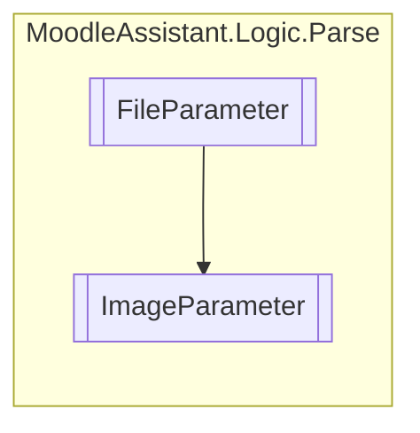

# ImageParameter `Public class`

## Description
Represents an image-type parameter in a template question.

## Diagram


## Members
### Methods
#### Public  methods
| Returns | Name |
| --- | --- |
| `StringBuilder` | [`Replace`](#replace)(`StringBuilder` builder)<br>Replaces the matched text in the provided StringBuilder with a replacement value. |

## Details
### Summary
Represents an image-type parameter in a template question.

### Inheritance
 - [
`FileParameter`
](./FileParameter.md)

### Constructors
#### ImageParameter
[*Source code*](https://github.com///blob//MoodleAssistant/Logic/Parse/ImageParameter.cs#L14)
```csharp
public ImageParameter(Match m)
```
##### Arguments
| Type | Name | Description |
| --- | --- | --- |
| `Match` | m | The Match object containing the regex match information. |

##### Summary
Initializes a new instance of the [ImageParameter](moodleassistant/logic/parse/ImageParameter.md) class.

### Methods
#### Replace
[*Source code*](https://github.com///blob//MoodleAssistant/Logic/Parse/ImageParameter.cs#L19)
```csharp
public override StringBuilder Replace(StringBuilder builder)
```
##### Arguments
| Type | Name | Description |
| --- | --- | --- |
| `StringBuilder` | builder | The StringBuilder containing the text to be replaced. |

##### Summary
Replaces the matched text in the provided StringBuilder with a replacement value.

##### Returns
The modified StringBuilder with the replacement text.

*Generated with* [*ModularDoc*](https://github.com/hailstorm75/ModularDoc)
