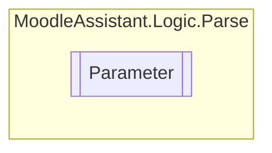

# Parameter `Public class`

## Description
Represents a parameter in a template question.

## Diagram


## Members
### Properties
#### Public  properties
| Type | Name | Methods |
| --- | --- | --- |
| `Match` | [`Match`](#match)<br>Gets the match object containing the regex match information. | `get` |
| `string` | [`Name`](#name)<br>Gets or sets the name of the parameter. | `get, protected init` |
| `string` | [`Replacement`](#replacement)<br>Gets or sets the replacement value for the parameter. | `get, set` |

### Methods
#### Public  methods
| Returns | Name |
| --- | --- |
| `StringBuilder` | [`Replace`](#replace)(`StringBuilder` builder)<br>Replaces the matched text in the provided StringBuilder with a replacement value. |

## Details
### Summary
Represents a parameter in a template question.

### Constructors
#### Parameter [1/2]
[*Source code*](https://github.com///blob//MoodleAssistant/Logic/Parse/Parameter.cs#L14)
```csharp
public Parameter(Match m)
```
##### Arguments
| Type | Name | Description |
| --- | --- | --- |
| `Match` | m | The match (of a Regular expression) of the parameter in the template question. |

##### Summary
Represents a parameter in a template question.

#### Parameter [2/2]
[*Source code*](https://github.com///blob//MoodleAssistant/Logic/Parse/Parameter.cs#L31)
```csharp
public Parameter(Match m, string name)
```
##### Arguments
| Type | Name | Description |
| --- | --- | --- |
| `Match` | m | The Match object containing the regex match information. |
| `string` | name | The name of the parameter. |

##### Summary
Initializes a new instance of the [Parameter](moodleassistant/logic/parse/Parameter.md) class with the specified match and name.

### Methods
#### Replace
[*Source code*](https://github.com///blob//MoodleAssistant/Logic/Parse/Parameter.cs#L40)
```csharp
public virtual StringBuilder Replace(StringBuilder builder)
```
##### Arguments
| Type | Name | Description |
| --- | --- | --- |
| `StringBuilder` | builder | The StringBuilder containing the text to be replaced. |

##### Summary
Replaces the matched text in the provided StringBuilder with a replacement value.

##### Returns
The modified StringBuilder with the replacement text.

### Properties
#### Name
```csharp
public string Name { get; protected init; }
```
##### Summary
Gets or sets the name of the parameter.

#### Match
```csharp
public Match Match { get; }
```
##### Summary
Gets the match object containing the regex match information.

#### Replacement
```csharp
public string Replacement { get; set; }
```
##### Summary
Gets or sets the replacement value for the parameter.

*Generated with* [*ModularDoc*](https://github.com/hailstorm75/ModularDoc)
