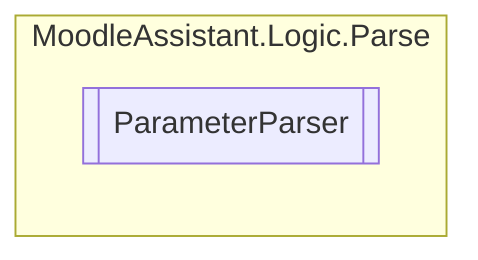

# ParameterParser `Public class`

## Description
Parses a string for parameters.

## Diagram


## Members
### Methods
#### Public  methods
| Returns | Name |
| --- | --- |
| `IEnumerable`&lt;[`Parameter`](./Parameter.md)&gt; | [`Match`](#match)()<br>Finds all parameters in the string, and returns them as a list. |
| `string` | [`Replace`](#replace)(`IEnumerable`&lt;[`Parameter`](./Parameter.md)&gt; parameters) |

## Details
### Summary
Parses a string for parameters.

### Constructors
#### ParameterParser
[*Source code*](https://github.com///blob//MoodleAssistant/Logic/Parse/ParameterParser.cs#L16707566)
```csharp
public ParameterParser(string str, bool previewMode)
```
##### Arguments
| Type | Name | Description |
| --- | --- | --- |
| `string` | str | The String to parse |
| `bool` | previewMode |  |

##### Summary
Parses a string for parameters.

### Methods
#### Match
[*Source code*](https://github.com///blob//MoodleAssistant/Logic/Parse/ParameterParser.cs#L22)
```csharp
public IEnumerable<Parameter> Match()
```
##### Summary
Finds all parameters in the string, and returns them as a list.

##### Returns
A list of [Parameter](./Parameter.md) instances found in the string.

#### Replace
[*Source code*](https://github.com///blob//MoodleAssistant/Logic/Parse/ParameterParser.cs#L49)
```csharp
public string Replace(IEnumerable<Parameter> parameters)
```
##### Arguments
| Type | Name | Description |
| --- | --- | --- |
| `IEnumerable`&lt;[`Parameter`](./Parameter.md)&gt; | parameters |   |

*Generated with* [*ModularDoc*](https://github.com/hailstorm75/ModularDoc)
