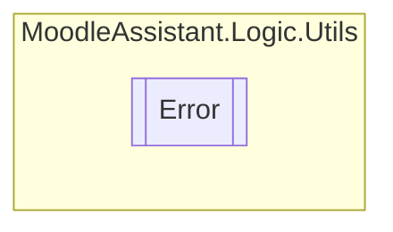

# Error `Public enum`

## Description
Represents an error that occurred in the replication process.

## Diagram

## Details
### Summary
Represents an error that occurred in the replication process.

### Fields
#### NoErrors
##### Summary
No errors occurred.

#### NoFiles
##### Summary
No files were uploaded.

#### NullFile
##### Summary
Uploaded files are null.

#### Unexpected
##### Summary
An unexpected error occurred.

#### NonXmlFile
##### Summary
The uploaded file is not a valid XML file.

#### EmptyFile
##### Summary
The uploaded file is empty.

#### XmlBadFormed
##### Summary
The uploaded XML file is not well-formatted.

#### ZeroOrMoreQuestions
##### Summary
The uploaded XML file has zero or more than one question.

#### ZeroAnswers
##### Summary
The uploaded XML file has no answers.

#### NonCsvFile
##### Summary
The uploaded file is not a valid CSV file.

#### CsvInvalidHeader
##### Summary
The uploaded CSV file has not a valid header.

#### CsvBadFormed
##### Summary
The uploaded CSV file is not well-formed.

#### NoValidFile
##### Summary
The uploaded file is not a valid image/MS-Office file.

#### FileMismatch
##### Summary
The uploaded files names or quantity do not match the values inside the CSV file.

*Generated with* [*ModularDoc*](https://github.com/hailstorm75/ModularDoc)
