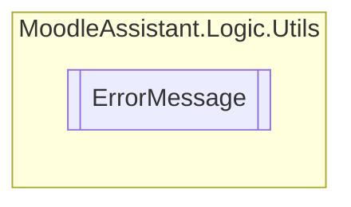

# ErrorMessage `Public class`

## Description
Contains error messages for the application.

## Diagram


## Members
### Methods
#### Public Static methods
| Returns | Name |
| --- | --- |
| `string` | [`GetErrorMessage`](#geterrormessage)([`Error`](./Error.md) error)<br>Returns the error message based on the error code. |

## Details
### Summary
Contains error messages for the application.

### Methods
#### GetErrorMessage
[*Source code*](https://github.com///blob//MoodleAssistant/Logic/Utils/ErrorMessage.cs#L39)
```csharp
public static string GetErrorMessage(Error error)
```
##### Arguments
| Type | Name | Description |
| --- | --- | --- |
| [`Error`](./Error.md) | error | The [Error](./Error.md) that occurred. |

##### Summary
Returns the error message based on the error code.

##### Returns
The string matching with the specified [Error](./Error.md) .

*Generated with* [*ModularDoc*](https://github.com/hailstorm75/ModularDoc)
