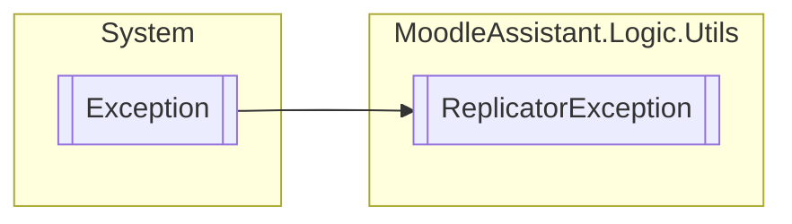

# ReplicatorException `Public class`

## Description
Represents an error that occurred in the replication process.

## Diagram


## Members
### Properties
#### Public  properties
| Type | Name | Methods |
| --- | --- | --- |
| [`Error`](./Error.md) | [`Error`](#error)<br>Gets the error. | `get` |

## Details
### Summary
Represents an error that occurred in the replication process.

### Inheritance
 - `Exception`

### Constructors
#### ReplicatorException
[*Source code*](https://github.com///blob//MoodleAssistant/Logic/Utils/ReplicatorException.cs#L11)
```csharp
public ReplicatorException(Error error)
```
##### Arguments
| Type | Name | Description |
| --- | --- | --- |
| [`Error`](./Error.md) | error | The [Error](./Error.md) that occurred. |

##### Summary
Represents an error that occurred in the replication process.

### Properties
#### Error
```csharp
public Error Error { get; }
```
##### Summary
Gets the error.

*Generated with* [*ModularDoc*](https://github.com/hailstorm75/ModularDoc)
