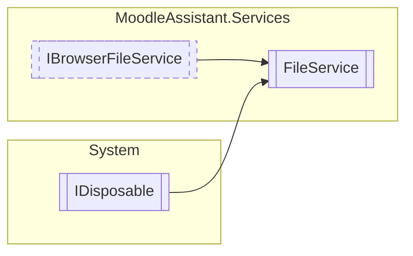

# FileService `Public class`

## Description
Represents a service that manages the file operations during a user session.

## Diagram


## Members
### Methods
#### Public  methods
| Returns | Name |
| --- | --- |
| `void` | [`DeleteAllFiles`](#deleteallfiles)()<br>Deletes all files. |
| `void` | [`DeleteFile`](#deletefile)(`string` fileName)<br>Deletes the file with the specified name. |
| `void` | [`Dispose`](#dispose)()<br>Disposes the service and deletes all files. |
| `string` | [`GetBase64`](#getbase64)(`string` fileName)<br>Gets the base64 string of the specified file. |
| `FileStream` | [`GetFile`](#getfile)(`string` fileName)<br>Gets the FileStream of the specified file. |
| `Task`&lt;`bool`&gt; | [`SaveFile`](#savefile)(`IBrowserFile` file, `string` fileName)<br>Saves the specified file. |

## Details
### Summary
Represents a service that manages the file operations during a user session.

### Inheritance
 - [
`IBrowserFileService`
](./IBrowserFileService.md)
 - `IDisposable`

### Constructors
#### FileService
[*Source code*](https://github.com///blob//MoodleAssistant/Services/FileService.cs#L19)
```csharp
public FileService(IWebHostEnvironment env)
```
##### Arguments
| Type | Name | Description |
| --- | --- | --- |
| `IWebHostEnvironment` | env | The IWebHostEnvironment instance that provides information about the web hosting environment. |

##### Summary
Represents a service that manages the file operations during a user session.

### Methods
#### SaveFile
```csharp
public virtual async Task<bool> SaveFile(IBrowserFile file, string fileName)
```
##### Arguments
| Type | Name | Description |
| --- | --- | --- |
| `IBrowserFile` | file | The instance of IBrowserFile to save. |
| `string` | fileName | The file's name. |

##### Summary
Saves the specified file.

##### Returns
`true` if the operation is successful; otherwise `false` .

#### GetFile
[*Source code*](https://github.com///blob//MoodleAssistant/Services/FileService.cs#L46)
```csharp
public virtual FileStream GetFile(string fileName)
```
##### Arguments
| Type | Name | Description |
| --- | --- | --- |
| `string` | fileName | The file's name. |

##### Summary
Gets the FileStream of the specified file.

##### Returns
The FileStream that encapsulates the file with the specified name.

#### DeleteFile
[*Source code*](https://github.com///blob//MoodleAssistant/Services/FileService.cs#L53)
```csharp
public virtual void DeleteFile(string fileName)
```
##### Arguments
| Type | Name | Description |
| --- | --- | --- |
| `string` | fileName | The name of the file to delete. |

##### Summary
Deletes the file with the specified name.

#### DeleteAllFiles
[*Source code*](https://github.com///blob//MoodleAssistant/Services/FileService.cs#L61)
```csharp
public virtual void DeleteAllFiles()
```
##### Summary
Deletes all files.

#### GetBase64
[*Source code*](https://github.com///blob//MoodleAssistant/Services/FileService.cs#L70)
```csharp
public virtual string GetBase64(string fileName)
```
##### Arguments
| Type | Name | Description |
| --- | --- | --- |
| `string` | fileName |   |

##### Summary
Gets the base64 string of the specified file.

##### Returns
The base64 string of the file.

#### Dispose
[*Source code*](https://github.com///blob//MoodleAssistant/Services/FileService.cs#L83)
```csharp
public virtual void Dispose()
```
##### Summary
Disposes the service and deletes all files.

*Generated with* [*ModularDoc*](https://github.com/hailstorm75/ModularDoc)
