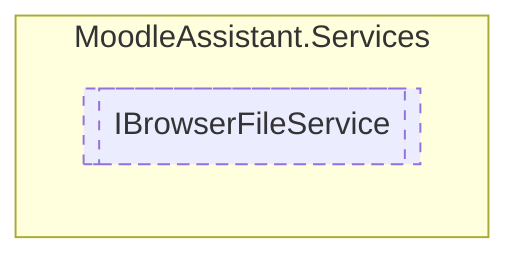

# IBrowserFileService `Public interface`

## Description
Represents a service that manages the file operations during a user session.

## Diagram


## Members
### Methods
#### Public  methods
| Returns | Name |
| --- | --- |
| `void` | [`DeleteAllFiles`](#deleteallfiles)()<br>Deletes all files. |
| `void` | [`DeleteFile`](#deletefile)(`string` fileName)<br>Deletes the file with the specified name. |
| `string` | [`GetBase64`](#getbase64)(`string` filename)<br>Gets the base64 string of the specified file. |
| `FileStream` | [`GetFile`](#getfile)(`string` fileName)<br>Gets the FileStream of the specified file. |
| `Task`&lt;`bool`&gt; | [`SaveFile`](#savefile)(`IBrowserFile` file, `string` fileName)<br>Saves the specified file. |

## Details
### Summary
Represents a service that manages the file operations during a user session.

### Methods
#### SaveFile
```csharp
public Task<bool> SaveFile(IBrowserFile file, string fileName)
```
##### Arguments
| Type | Name | Description |
| --- | --- | --- |
| `IBrowserFile` | file | The instance of IBrowserFile to save. |
| `string` | fileName | The file's name. |

##### Summary
Saves the specified file.

##### Returns
`true` if the operation is successful; otherwise `false` .

#### GetFile
```csharp
public FileStream GetFile(string fileName)
```
##### Arguments
| Type | Name | Description |
| --- | --- | --- |
| `string` | fileName | The file's name. |

##### Summary
Gets the FileStream of the specified file.

##### Returns
The FileStream that encapsulates the file with the specified name.

#### DeleteFile
```csharp
public void DeleteFile(string fileName)
```
##### Arguments
| Type | Name | Description |
| --- | --- | --- |
| `string` | fileName | The name of the file to delete. |

##### Summary
Deletes the file with the specified name.

#### DeleteAllFiles
```csharp
public void DeleteAllFiles()
```
##### Summary
Deletes all files.

#### GetBase64
```csharp
public string GetBase64(string filename)
```
##### Arguments
| Type | Name | Description |
| --- | --- | --- |
| `string` | filename | The file's name. |

##### Summary
Gets the base64 string of the specified file.

##### Returns
The base64 string of the file.

*Generated with* [*ModularDoc*](https://github.com/hailstorm75/ModularDoc)
