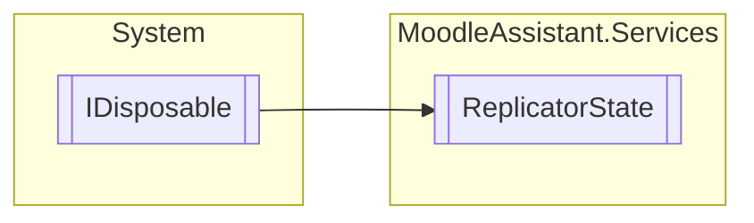

# ReplicatorState `Public class`

## Description
Represents the current state of the program, during the current user session.

## Diagram


## Members
### Properties
#### Public  properties
| Type | Name | Methods |
| --- | --- | --- |
| `int` | [`AnswerCount`](#answercount)<br>Gets or sets the number of answers in the template question. | `get, set` |
| `IEnumerable`&lt;`string``[]`&gt; | [`CsvAsList`](#csvaslist)<br>Gets or sets the CSV file as a list of string arrays. | `get, set` |
| `XmlDocument` | [`Merged`](#merged)<br>Gets or sets the merged XML document. | `get, set` |
| [`ParameterModel`](../logic/models/ParameterModel.md) | [`Parameters`](#parameters)<br>Gets or sets the parameters model of the current merged question (if any). | `get, set` |
| [`PreviewModel`](../logic/models/PreviewModel.md) | [`Preview`](#preview)<br>Gets or sets the preview model of the current merged question (if any). | `get, set` |
| `XmlDocument` | [`Template`](#template)<br>Gets or sets the template XML document. | `get, set` |

### Methods
#### Public  methods
| Returns | Name |
| --- | --- |
| `void` | [`Dispose`](#dispose)()<br>Disposes the current state of the program. |
| `void` | [`Reset`](#reset)()<br>Resets the state of the program. |

## Details
### Summary
Represents the current state of the program, during the current user session.

### Inheritance
 - `IDisposable`

### Constructors
#### ReplicatorState
[*Source code*](https://github.com///blob//MoodleAssistant/Services/ReplicatorState.cs#L23)
```csharp
public ReplicatorState()
```

### Methods
#### Reset
[*Source code*](https://github.com///blob//MoodleAssistant/Services/ReplicatorState.cs#L43)
```csharp
public void Reset()
```
##### Summary
Resets the state of the program.

#### Dispose
[*Source code*](https://github.com///blob//MoodleAssistant/Services/ReplicatorState.cs#L53)
```csharp
public virtual void Dispose()
```
##### Summary
Disposes the current state of the program.

### Properties
#### Preview
```csharp
public PreviewModel Preview { get; set; }
```
##### Summary
Gets or sets the preview model of the current merged question (if any).

#### Parameters
```csharp
public ParameterModel Parameters { get; set; }
```
##### Summary
Gets or sets the parameters model of the current merged question (if any).

#### CsvAsList
```csharp
public IEnumerable<string> CsvAsList { get; set; }
```
##### Summary
Gets or sets the CSV file as a list of string arrays.

#### Template
```csharp
public XmlDocument Template { get; set; }
```
##### Summary
Gets or sets the template XML document.

#### Merged
```csharp
public XmlDocument Merged { get; set; }
```
##### Summary
Gets or sets the merged XML document.

#### AnswerCount
```csharp
public int AnswerCount { get; set; }
```
##### Summary
Gets or sets the number of answers in the template question.

*Generated with* [*ModularDoc*](https://github.com/hailstorm75/ModularDoc)
